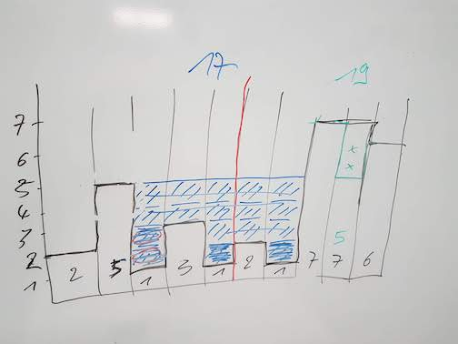

# b612-dojo

> Coding-dojo au B612

# Séance du 17/12/2018
Calcul de volume.

## Objectif
Travailler le TDD.

## Sujet -
### 17/12/2018

Sur un tableau simple (indice, valeur), cacluler le potentiel volum entre les creux en prennant en compte le possible écoulement sur les cotés.

Exemple : ici le volume devra être 2+5=7

            |2|         |2|
        |1| | |   |1|1|1| |
        | | | |0|0| | | | |
        -------------------

Autre exemple(s) :

